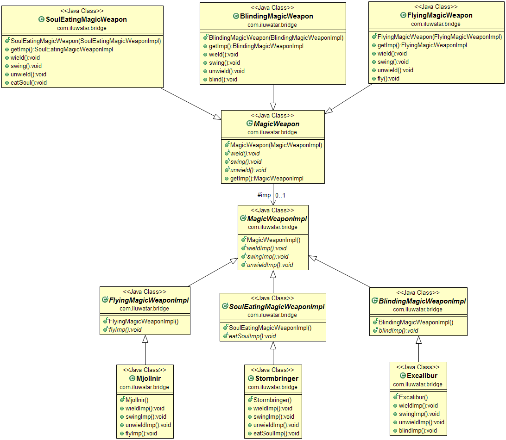

**Also known as:** Handle/Body

**Intent:** Decouple an abstraction from its implementation so that the two can
vary independently.

**Applicability:** Use the Bridge pattern when

* you want to avoid a permanent binding between an abstraction and its implementation. This might be the case, for example, when the implementation must be selected or switched at run-time.
* both the abstractions and their implementations should be extensible by subclassing. In this case, the Bridge pattern lets you combine the different abstractions and implementations and extend them independently
* changes in the implementation of an abstraction should have no impact on clients; that is, their code should not have to be recompiled.
* you have a proliferation of classes. Such a class hierarchy indicates the need for splitting an object into two parts. Rumbaugh uses the term "nested generalizations" to refer to such class hierarchies
* you want to share an implementation among multiple objects (perhaps using reference counting), and this fact should be hidden from the client. A simple example is Coplien's String class, in which multiple objects can share the same string representation.

**Credits**

* [Design Patterns: Elements of Reusable Object-Oriented Software](http://www.amazon.com/Design-Patterns-Elements-Reusable-Object-Oriented/dp/0201633612)
